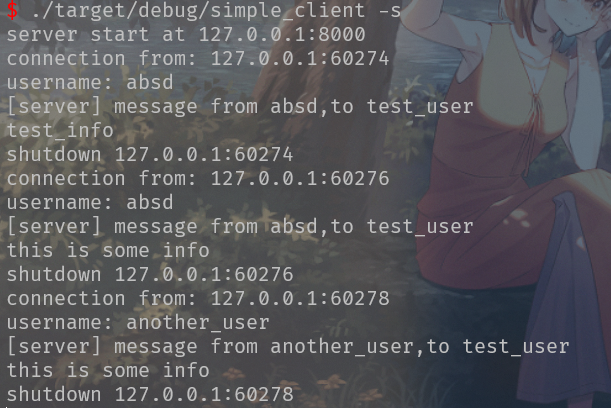

# simple_client

## usage

> usage:
>
> ​	./simple_client [mode] [option]
>
> mode:
>
> ​	-s –server 以服务端启动
>
> ​	-h –help 输出提示信息
>
> ​	–version 输出版本号
>
>  options:
>
> ​	-u —username [username] 
>
> ​	-a  —address [address]
>
> ​	-S –send [message]
>
> ​	-r –receive 
>
> ​	-R –receiver [username]

## example

客户端(client)

server接收的信息

